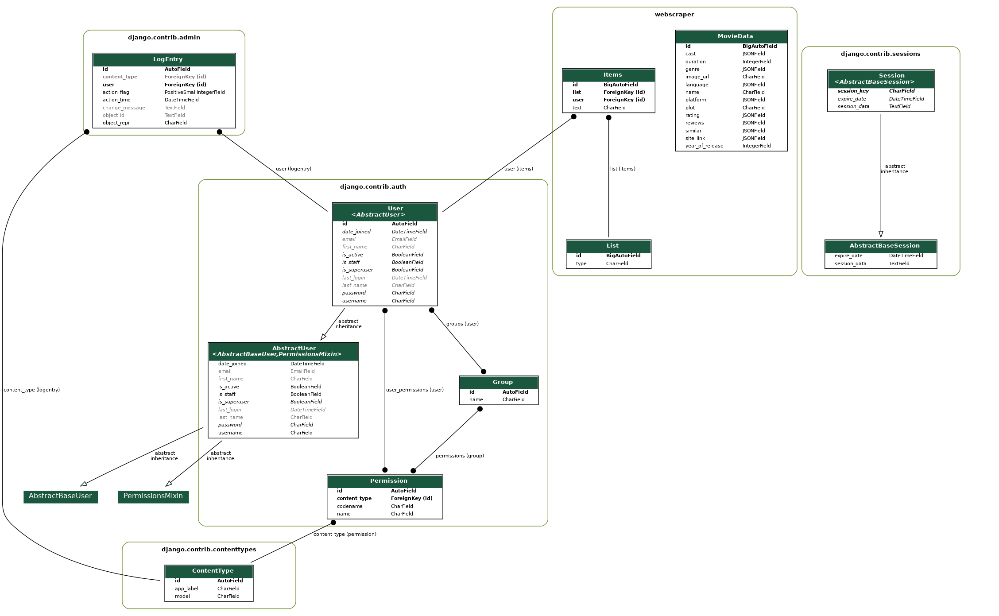

# cinemaA-Z
CS251 Course Project

Created with :heart: by team *Kyumt Cat*, consisting of Adyasha Patra, Dhananjay Raman, and Tanay Tayal.

Usage:
- Clone repository to local system, navigate to the folder and run `python3 manage.py runserver`
- Click on `root` url to be redirected to home page of website
- One admin account already exists: Username - dhano, Password - dhano

URLs Directory:
- `/home/`: Home page, displays current top 10 movies, and users watchlist, watched, and liked movies, and recommends new movies based on movies similar to liked movies
- `/register/`: Registration page
- `/login/`: Login page
- `/user/`: Profile page for logged in user
- `/admin/`: Admin page for superusers
- `/<id>`: Movie page with the corresponding id, in the database
- `/search/?q=<query>`: Search page displayind results for given query
- `/save-movies`: Scrapes for new movies and stores them in database
- `/save-tvshows`: Scrapes for new tv shows and stores them in database

Requirements:
- django
- crispy forms, install using `pip install crispy-bootstrap5`
- sphinx 4.* for documentation generation

Schema (of all databases involved):

